# Cryptic IP Binding Sites

[](https://github.com/Tommaso-R-Marena/cryptic-ip-binding-sites/actions/workflows/ci.yml)
[](https://github.com/Tommaso-R-Marena/cryptic-ip-binding-sites/actions/workflows/data-validation.yml)
[](https://www.python.org/downloads/)
[](https://opensource.org/licenses/MIT)
[](https://doi.org/10.5281/zenodo.placeholder)

## Systematic Discovery of Buried Inositol Phosphate Binding Sites Across Proteomes

> **A computational pipeline for identifying cryptic IP-binding sites where inositol phosphates function as structural folding cofactors rather than signaling molecules.**

---

## 🔬 The Scientific Question

Some proteins don't just bind inositol phosphates (IPs) for signaling—**they cannot fold without them**. The IP molecule sits completely buried in the protein core, invisible from the surface, essential for both structure and function.

### The Paradigm: ADAR2

[Macbeth et al. (2005, *Science* 309:1534-1539)](https://doi.org/10.1126/science.1115248) solved the ADAR2 crystal structure and found an **IP6 molecule completely buried** inside the enzyme:
- SASA ≈ 0 ² (only an 8.4 × 4.6 ² window to exterior)
- Zero catalytic activity without IP6
- Six basic residues coordinate the IP6 directly
- The protein **literally cannot exist** without the cofactor

### The Unknown

**How many other proteins have cryptic IP-binding sites?** Nobody has looked systematically.

This project builds the first **proteome-wide computational screen** to answer that question.

---

## 📒 Interactive Notebooks

Explore the complete analysis pipeline through executable Jupyter notebooks:

| Notebook | Description | Interactive Launch |
|----------|-------------|-------------------|
| **01_Quick_Start** | Installation validation and basic usage | [](https://mybinder.org/v2/gh/Tommaso-R-Marena/cryptic-ip-binding-sites/main?filepath=notebooks/01_Quick_Start.ipynb) [](https://colab.research.google.com/github/Tommaso-R-Marena/cryptic-ip-binding-sites/blob/main/notebooks/01_Quick_Start.ipynb) |
| **02_ADAR2_Analysis** | Complete ADAR2 validation with real crystal structure data | [](https://mybinder.org/v2/gh/Tommaso-R-Marena/cryptic-ip-binding-sites/main?filepath=notebooks/02_ADAR2_Analysis.ipynb) [](https://colab.research.google.com/github/Tommaso-R-Marena/cryptic-ip-binding-sites/blob/main/notebooks/02_ADAR2_Analysis.ipynb) |
| **03_Proteome_Screening** | Large-scale screening workflow | [](https://mybinder.org/v2/gh/Tommaso-R-Marena/cryptic-ip-binding-sites/main?filepath=notebooks/03_Proteome_Screening.ipynb) [](https://colab.research.google.com/github/Tommaso-R-Marena/cryptic-ip-binding-sites/blob/main/notebooks/03_Proteome_Screening.ipynb) |
| **04_Validation_Analysis** | Positive/negative control validation suite | [](https://mybinder.org/v2/gh/Tommaso-R-Marena/cryptic-ip-binding-sites/main?filepath=notebooks/04_Validation_Analysis.ipynb) [](https://colab.research.google.com/github/Tommaso-R-Marena/cryptic-ip-binding-sites/blob/main/notebooks/04_Validation_Analysis.ipynb) |
| **05_Results_Analysis** | Comparative proteomics and statistical analysis | [](https://mybinder.org/v2/gh/Tommaso-R-Marena/cryptic-ip-binding-sites/main?filepath=notebooks/05_Results_Analysis.ipynb) [](https://colab.research.google.com/github/Tommaso-R-Marena/cryptic-ip-binding-sites/blob/main/notebooks/05_Results_Analysis.ipynb) |
| **🆕 06_Protein_Engineering** | **Full computational pipeline: Engineer IP6-dependent sfGFP with MD & QM/MM** | [](https://colab.research.google.com/github/Tommaso-R-Marena/cryptic-ip-binding-sites/blob/main/notebooks/06_Protein_Engineering_Pipeline.ipynb) |

**All notebooks use real data** from:
- AlphaFold Protein Structure Database ([alphafold.ebi.ac.uk](https://alphafold.ebi.ac.uk))
- RCSB Protein Data Bank ([rcsb.org](https://www.rcsb.org))
- UniProt ([uniprot.org](https://www.uniprot.org))

### ✨ NEW: Protein Engineering Pipeline

Notebook 06 implements a **complete computational workflow** for engineering an IP6-dependent fluorescent protein:

- ✅ **Structure-based design**: Graft ADAR2-like IP6 pocket into superfolder GFP
- ✅ **Molecular dynamics**: OpenMM simulations (± IP6, explicit solvent, 10+ ns)
- ✅ **QM/MM calculations**: Quantum tunneling analysis with DFT
- ✅ **Experimental protocols**: Wet-lab validation design (fluorescence, DSF, refolding kinetics)
- ✅ **No placeholders**: All code fully implemented and executable in Colab

**🎯 Goal**: Create first rationally designed protein that requires buried IP6 for folding, enabling direct experimental proof of cryptic IP cofactor mechanism and quantum effects.

---

## ⚙️ Methodology

### Computational Pipeline

We integrate three established structural bioinformatics tools with AlphaFold predictions:

```mermaid
graph LR
    A[AlphaFold Structure] --> B[fpocket<br/>Pocket Detection]
    B --> C[FreeSASA<br/>Burial Analysis]
    C --> D[APBS<br/>Electrostatics]
    D --> E[Composite Scoring]
    E --> F{Score ≥ 0.7?}
    F -->|Yes| G[High-Confidence<br/>Candidate]
    F -->|No| H[Exclude]
```



### Identification Criteria

Cryptic IP-binding site candidates must satisfy:

| Criterion | Threshold | Rationale |
|-----------|-----------|----------|
| **Pocket Depth** | >15 Å | Deeply buried, not surface-accessible |
| **Solvent Accessibility** | SASA <5 Ų | Minimal water exposure |
| **Electrostatic Potential** | >+5 kT/e | Strong positive charge for phosphate coordination |
| **Basic Residue Cluster** | ≥4 Arg/Lys/His | Direct coordination of phosphates |
| **Pocket Volume** | 300–800 ų | Appropriate for IP3–IP6 |
| **Structure Confidence** | pLDDT ≥70 | High AlphaFold confidence |

### Validation Strategy

**Positive Controls** (must detect):
- **ADAR2** ([PDB: 1ZY7](https://www.rcsb.org/structure/1ZY7)) - Buried IP6, gold standard
- **Pds5B** ([PDB: 5HDT](https://www.rcsb.org/structure/5HDT)) - Buried IP6 in cohesin regulator
- **HDAC1** ([PDB: 5ICN](https://www.rcsb.org/structure/5ICN)) - Interface IP4

**Negative Controls** (must reject):
- **PLCδ1 PH domain** ([PDB: 1MAI](https://www.rcsb.org/structure/1MAI)) - Surface IP3 binding
- **Btk PH domain** ([PDB: 1BTK](https://www.rcsb.org/structure/1BTK)) - Surface IP4 binding

---

## 🌍 Three-Organism Comparative Screen

### Why These Three?

| Organism | Proteome Size | IP6 Concentration | Scientific Rationale |
|----------|--------------|-------------------|---------------------|
| **🍂 *S. cerevisiae* (Yeast)** | ~6,000 proteins<br/>[UP000002311](https://www.uniprot.org/proteomes/UP000002311) | ~20 μM | **Genetic tractability**: IP biosynthesis knockouts available, fast validation |
| **🧑 *H. sapiens* (Human)** | ~23,000 proteins<br/>[UP000005640](https://www.uniprot.org/proteomes/UP000005640) | ~25 μM | **Clinical relevance**: Disease connections, known examples |
| **🦦 *D. discoideum* (Slime Mold)** | ~12,600 proteins<br/>[UP000002195](https://www.uniprot.org/proteomes/UP000002195) | **~520 μM** | **Evolutionary test**: 10× higher IP6 than mammals. Do high-IP organisms have more buried sites? |

### The Comparative Hypothesis

If buried IP-binding co-evolved with cellular IP metabolism:
- **Prediction**: *D. discoideum* should have proportionally **more** cryptic IP sites
- **Null hypothesis**: Hit rate independent of IP concentration → ancient structural role

**Either result is publishable and biologically significant.**

---

## 🚀 Installation

### Quick Start (5 minutes)

```bash
# Clone repository
git clone https://github.com/Tommaso-R-Marena/cryptic-ip-binding-sites.git
cd cryptic-ip-binding-sites

# Create environment with all dependencies
conda env create -f environment.yml
conda activate cryptic-ip

# Install package
pip install -e .

# Verify installation
cryptic-ip --version
cryptic-ip check-dependencies
```

### External Tools

Required structural bioinformatics software:

- **fpocket** 4.0+: Pocket detection ([GitHub](https://github.com/Discngine/fpocket))
- **FreeSASA** 2.0+: Solvent accessibility ([GitHub](https://github.com/mittinatten/freesasa))
- **APBS** 3.0+: Electrostatics ([APBS](http://www.poissonboltzmann.org/))

All installable via conda:
```bash
conda install -c conda-forge fpocket freesasa apbs pdb2pqr
```

See [INSTALLATION.md](docs/INSTALLATION.md) for detailed instructions.

---

## 📊 Real Data Sources

### Structural Databases

**AlphaFold predictions** (primary screening dataset):
```bash
# Yeast proteome (~15 GB)
wget https://ftp.ebi.ac.uk/pub/databases/alphafold/latest/UP000002311_559292_YEAST_v4.tar

# Human proteome (~50 GB)
wget https://ftp.ebi.ac.uk/pub/databases/alphafold/latest/UP000005640_9606_HUMAN_v4.tar

# Dictyostelium proteome (~30 GB)
wget https://ftp.ebi.ac.uk/pub/databases/alphafold/latest/UP000002195_44689_DICDI_v4.tar
```

**Crystal structures** (validation ground truth):
- Downloaded programmatically from [RCSB PDB](https://www.rcsb.org) REST API
- Entries: 1ZY7, 5HDT, 5ICN, 4A69, 1MAI, 1BTK, 1FAO, 1FGY

### Metadata Integration

**UniProt API** for protein annotations:
```python
from cryptic_ip.database import UniProtClient

client = UniProtClient()
metadata = client.fetch_protein_info('P78563')  # ADAR2
print(metadata['gene_name'])  # ADARB1
print(metadata['function'])   # RNA editing enzyme...
```

**PDB API** for experimental details:
```python
from cryptic_ip.database import PDBClient

client = PDBClient()
entry = client.fetch_entry_info('1ZY7')
print(entry['resolution'])  # 1.7 Å
print(entry['method'])      # X-RAY DIFFRACTION
```

---

## 🔬 Usage Examples

### Command Line Interface

```bash
# Analyze single protein
cryptic-ip analyze AF-P78563-F1-model_v4.pdb --output results/

# Screen yeast proteome
cryptic-ip screen \
    --proteome yeast \
    --structures data/yeast/ \
    --output yeast_results.csv \
    --jobs 8 \
    --threshold 0.7

# Validate on known positives/negatives
cryptic-ip validate \
    --positives 1ZY7.pdb,5HDT.pdb \
    --negatives 1MAI.pdb,1BTK.pdb \
    --report validation_report.pdf
```

### Python API

```python
from cryptic_ip.pipeline import AnalysisPipeline
from cryptic_ip.database import AlphaFoldDownloader

# Download structure from AlphaFold
downloader = AlphaFoldDownloader()
structure = downloader.fetch('P78563')  # ADAR2

# Run analysis pipeline
pipeline = AnalysisPipeline(
    score_threshold=0.7,
    plddt_threshold=70.0
)

result = pipeline.analyze(
    structure,
    protein_name='ADAR2',
    uniprot_id='P78563'
)

# Access results
print(f"Top pocket score: {result.top_candidate['score']:.3f}")
print(f"Depth: {result.top_candidate['depth']:.1f} Å")
print(f"SASA: {result.top_candidate['sasa']:.2f} Å")
print(f"Basic residues: {result.top_candidate['n_basic']}")

# Visualize
result.generate_pymol_session('adar2_analysis.pse')
result.plot_electrostatics('electrostatics.png')
```

---

## 📊 Expected Results

### Hit Rate Estimates

Based on literature precedent (ADAR2, Pds5B, HDACs, ADAT1):

| Proteome | Expected Hits | Hit Rate | Functional Enrichment |
|----------|--------------|----------|----------------------|
| Yeast | 10–50 | 0.2–0.8% | Nuclear, RNA processing |
| Human | 50–200 | 0.2–0.9% | Chromatin, transcription |
| Dictyostelium | **?** | **Testable** | Co-evolution prediction |

### Output Files

For each proteome:
1. **Ranked candidate list** (CSV) with scores and structural metrics
2. **PyMOL visualization sessions** for top 50 candidates
3. **Electrostatic maps** (OpenDX format)
4. **Statistical summary** (JSON metadata)
5. **Manuscript figures** (publication-quality PDFs)

---

## 📘 Documentation

### Complete Guides

- **[Installation Guide](docs/INSTALLATION.md)**: System requirements, dependencies, troubleshooting
- **[Tutorial](docs/TUTORIAL.md)**: Step-by-step walkthrough with code examples
- **[API Reference](docs/API.md)**: Complete function and class documentation
- **[Getting Started](docs/GETTING_STARTED.md)**: Quick start for new users

### Research Context

- **[Project Overview](docs/PROJECT_OVERVIEW.md)**: Scientific motivation and experimental plan
- **[Methods](docs/METHODS.md)**: Detailed computational methodology
- **[Validation Strategy](docs/VALIDATION.md)**: Quality control and benchmarking

---

## 🧪 Testing & Quality Assurance

### Continuous Integration

- **Unit tests**: pytest suite covering all modules
- **Integration tests**: End-to-end ADAR2 validation
- **Notebook execution**: All notebooks tested on CI
- **Code quality**: flake8, black, mypy, isort
- **Security scanning**: Bandit, safety

### Test Coverage

```bash
# Run full test suite
pytest tests/ -v --cov=cryptic_ip --cov-report=html

# Run specific validation
pytest tests/validation/test_adar2.py -v -s

# Execute notebooks
jupyter nbconvert --execute notebooks/*.ipynb
```

Current coverage: **>85%** for core analysis modules.

---

## 📚 Citation

If you use this pipeline in your research, please cite:

```bibtex
@software{marena2026cryptic,
  author = {Marena, Tommaso R.},
  title = {Cryptic IP Binding Sites: Systematic Discovery of Buried Inositol Phosphate Cofactors},
  year = {2026},
  publisher = {GitHub},
  journal = {GitHub repository},
  url = {https://github.com/Tommaso-R-Marena/cryptic-ip-binding-sites},
  doi = {10.5281/zenodo.placeholder}
}
```

### Key References

1. **Macbeth et al. (2005).** Inositol hexakisphosphate is bound in the ADAR2 core and required for RNA editing. *Science* **309**(5740):1534-1539. [DOI: 10.1126/science.1115248](https://doi.org/10.1126/science.1115248)

2. **Dick et al. (2018).** Inositol phosphates are assembly co-factors for HIV-1. *Nature* **560**(7719):509-512. [DOI: 10.1038/s41586-018-0396-4](https://doi.org/10.1038/s41586-018-0396-4)

3. **Jumper et al. (2021).** Highly accurate protein structure prediction with AlphaFold. *Nature* **596**(7873):583-589. [DOI: 10.1038/s41586-021-03819-2](https://doi.org/10.1038/s41586-021-03819-2)

4. **Pisani et al. (2014).** Analysis of Dictyostelium discoideum inositol pyrophosphate metabolism. *Advances in Biological Regulation* **54**:215-225. [DOI: 10.1016/j.jbior.2013.08.006](https://doi.org/10.1016/j.jbior.2013.08.006)

---

## 🤝 Contributing

Contributions welcome! This is an active research project.

### Ways to Contribute

1. **Report bugs** via [GitHub Issues](https://github.com/Tommaso-R-Marena/cryptic-ip-binding-sites/issues)
2. **Suggest features** or improvements
3. **Submit pull requests** for bug fixes or enhancements
4. **Validate results** on additional known IP-binding proteins
5. **Share your findings** if you discover novel candidates

### Development Setup

```bash
# Fork repository and clone
git clone https://github.com/YOUR-USERNAME/cryptic-ip-binding-sites.git
cd cryptic-ip-binding-sites

# Install development dependencies
pip install -e ".[dev]"

# Install pre-commit hooks
pre-commit install

# Run tests
pytest tests/
```

See [CONTRIBUTING.md](CONTRIBUTING.md) for guidelines.

---

## 📧 Contact

**Tommaso R. Marena**  
The Catholic University of America  
Department of Chemistry | Department of Philosophy  

- **GitHub**: [@Tommaso-R-Marena](https://github.com/Tommaso-R-Marena)  
- **Email**: marena@cua.edu  
- **ORCID**: [0000-0000-0000-0000](https://orcid.org/0000-0000-0000-0000) *(placeholder)*

---

## 📄 License

MIT License - see [LICENSE](LICENSE) file for details.

This software is provided for research and educational purposes. External tools (fpocket, APBS, FreeSASA) have their own licenses.

---

## 🛠️ Project Status

**Current Phase**: Phase 1 - Tool Validation (Complete)  
**Next Milestone**: Phase 2 - Database Construction  
**Target**: Phase 3 - Proteome-Wide Screening  

### Roadmap

- [x] Core pipeline implementation
- [x] ADAR2 validation
- [x] Negative control validation
- [x] Documentation and notebooks
- [x] CI/CD setup
- [x] **Protein engineering pipeline (MD + QM/MM)**
- [ ] Yeast proteome screen
- [ ] Human proteome screen
- [ ] Dictyostelium proteome screen
- [ ] Comparative analysis
- [ ] Manuscript preparation

**Last Updated**: February 2026

---

<p align="center">
  <strong>Discovering the hidden structural roles of inositol phosphates</strong>
</p>

<p align="center">
  <a href="https://github.com/Tommaso-R-Marena/cryptic-ip-binding-sites/issues">Report Bug</a>
  ·
  <a href="https://github.com/Tommaso-R-Marena/cryptic-ip-binding-sites/issues">Request Feature</a>
  ·
  <a href="docs/TUTORIAL.md">View Tutorial</a>
</p>