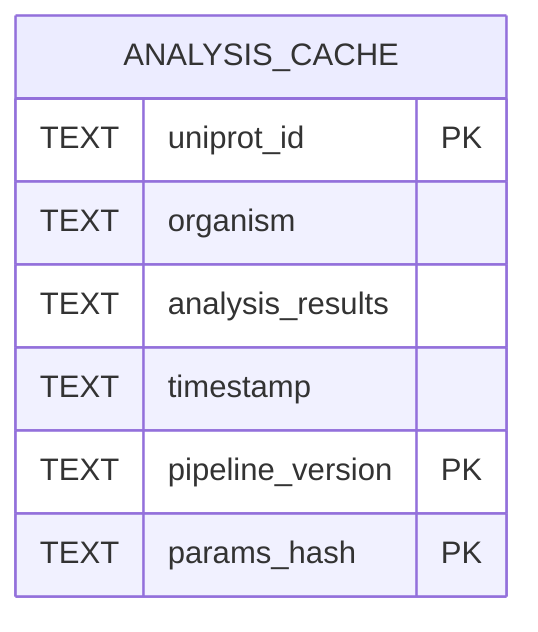

# Batch Processing Infrastructure for AlphaFold Proteomes

This module is designed for 40,000+ structure runs and includes:

1. **AlphaFold proteome batch download** with retries, rate limiting, progress, and resume.
2. **SQLite cache** keyed by pipeline version + parameter hash.
3. **Multiprocessing analysis** with memory-friendly chunking and ETA tracking.
4. **Checkpoint/resume** for long-running jobs.

## Database schema diagram



> Primary key is composite: `(uniprot_id, pipeline_version, params_hash)`.

## Usage examples

### 1) Download AlphaFold structures for multiple proteomes

```python
from cryptic_ip.database.batch_processing import AlphaFoldBatchDownloader

downloader = AlphaFoldBatchDownloader(
    output_dir="data/alphafold",
    state_path="data/alphafold/download_state.json",
    requests_per_second=3.0,
    max_retries=5,
)

summary = downloader.download_proteomes(
    ["UP000002311", "UP000005640", "UP000002195"],
    resume=True,
)
print(summary)
```

### 2) Cache analysis results (with automatic invalidation)

```python
from cryptic_ip.database.batch_processing import AnalysisCache

cache = AnalysisCache(
    db_path="results/analysis_cache.sqlite",
    pipeline_version="v2.1.0",
    pipeline_params={"score_threshold": 0.6, "model": "xgb"},
)

# optional cleanup for changed params/version
cache.invalidate_outdated_cache()

if (result := cache.get_cached_result("P78563", "Homo sapiens")) is None:
    result = {"composite_score": 0.81, "pocket_count": 3}
    cache.set_cached_result("P78563", "Homo sapiens", result)

cache.export_results("results/analysis_cache.csv", "csv")
cache.export_results("results/analysis_cache.json", "json")
cache.export_results("results/analysis_cache.h5", "hdf5")
cache.close()
```

### 3) Run parallel chunked processing + checkpointing

```python
from cryptic_ip.database.batch_processing import ParallelProcessor, append_results_to_file


def analyze(item):
    # item contains at least: uniprot_id, organism, filepath
    return {
        "uniprot_id": item["uniprot_id"],
        "organism": item["organism"],
        "composite_score": 0.75,
    }

processor = ParallelProcessor(
    analyze_function=analyze,
    workers=16,
    chunk_size=250,
    checkpoint_path="results/process_checkpoint.json",
)

results = processor.run(items=protein_items, resume=True)
append_results_to_file(results, "results/incremental_results.csv")
```

### 4) Multi-day execution pattern

- Use `resume=True` for both downloader and processor.
- Keep checkpoint files on durable storage.
- Flush incremental outputs after each chunk.
- Restart the same command after interruption; already-processed proteins are skipped.

